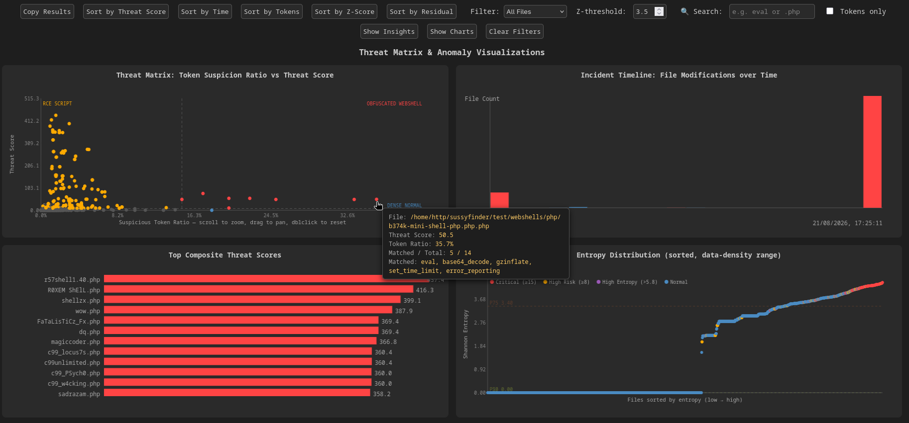
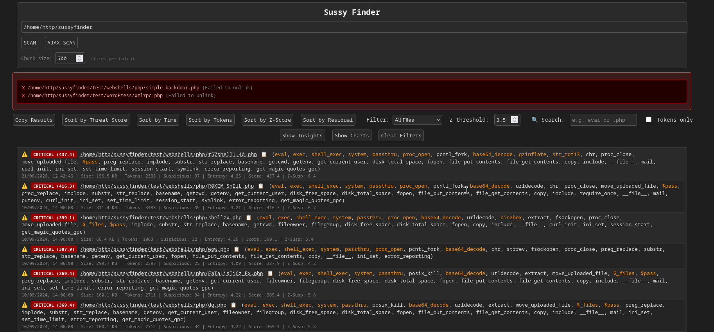

# SussyFinder

[](https://makeapullrequest.com)

PHP web application that scans a directory for PHP and related files and analyses each one for malicious code.

It combines token-based pattern matching, statistical anomaly detection (Shannon entropy, robust Z-scores), and MD5 hash whitelist/blacklisting to help identify suspicious files in a web server environment.

> **⚠️ Use with caution** – this tool can delete files identified as blacklisted. Always review flagged files before taking action.

## Features

* **Recursive directory scanning** with symlink loop protection; symlinked directories leading outside the scanned directory are reported, not followed, and directories that can't be listed are reported instead of skipped silently
* **Token-based detection** – scans PHP tokens for known obfuscation, shell execution, file I/O, and credential-related functions (method names like `$pdo->exec()` and text inside strings/comments are ignored)
* **Structural detection** – catches what name matching can't: calls through variables or superglobals (`$_GET['a']($_GET['b'])`), function names hidden in strings (`'ba'.'se64_decode'`, `"\x73ystem"`), `preg_replace` with `/e`, backtick shell execution, payloads after `__halt_compiler()`, and giant single-line blobs
* **MD5 hash whitelist & blacklist** – skip known-good files (e.g., from common frameworks) and auto-delete known-bad files
* **Shannon entropy calculation** – per-file byte entropy detects heavily obfuscated or encoded content
* **Tiny ML model**: a 4 KB logistic regression over hashed token features, run in the browser. Its score adds points to the threat score, so it can lift a file the rules underrate; it never lowers a score.
* **Client-side statistical analysis** – computes robust (median/MAD) Z-scores for size, mtime, tokens, suspicious token count, entropy and the ctime–mtime gap, plus residuals and file-owner rarity, to flag outliers
* **Interactive web interface** with:

  * Sort by modification time, suspicious token count, Z-score, or residual
  * Filter to show only anomalies
  * One-click copy of results (with full details)
  * Click a file path to copy it; the 📋 icon copies its MD5 hash
  * Linked charts: drag a box on the Threat Matrix or Entropy chart, or click a timeline bar, to select those files (Ctrl/⌘ adds more); the table then shows only the selection, and Esc clears it. Charts fade whatever the table's filters hide, hovering a file in a chart highlights its table row (and the other way round), and the Threat Matrix zooms with the wheel, pans with Shift+drag and resets on double-click
* **Color-coded output** – highlights blacklisted, unreadable, and suspicious files
* **Self-contained** – single PHP file, no external dependencies

## Statistical Analysis

SussyFinder uses several statistical techniques to identify files whose characteristics differ significantly from the rest of the scanned dataset.

### Shannon Entropy

Shannon entropy measures the amount of information or randomness in a dataset. SussyFinder applies it to the raw bytes of each file (computed server-side).

The entropy is calculated as:

$$
H(X) = -\sum_{i=1}^{n} p(x_i)\log_2 p(x_i)
$$

Where:

* $H(X)$ = Shannon entropy
* $p(x_i)$ = probability of symbol $x_i$
* $n$ = number of unique symbols

The probability of each symbol is:

$$
p(x_i) = \frac{c_i}{N}
$$

Where:

* $c_i$ = number of occurrences of symbol $x_i$
* $N$ = total number of characters

Higher entropy indicates a more diverse and less predictable character distribution, which can be useful for identifying encoded or obfuscated content.

For example:

| Data                | Approximate Entropy |
| ------------------- | ------------------: |
| `AAAAAA`            |                   0 |
| `ABCDEF`            |      $\approx 2.58$ |
| Random/encoded data |              Higher |

Plain PHP source sits around 4.5–5.2 bits/byte. SussyFinder treats a file as high-entropy above:

$$
\text{entropy} > 5.5
$$

### Median and MAD

Mean and standard deviation are pulled toward the very outliers being hunted (and toward huge vendor files), which lets them hide. SussyFinder uses the median and the median absolute deviation (MAD) instead:

$$
\tilde{x} = \operatorname{median}(x_1, \dots, x_n)
\qquad
\mathrm{MAD} = \operatorname{median}(|x_i - \tilde{x}|)
$$

The spread is scaled so it matches a standard deviation on normally distributed data:

$$
s = 1.4826 \times \mathrm{MAD}
$$

When more than half the values tie (MAD = 0, e.g. most files match no suspicious tokens), the mean absolute deviation is used instead:

$$
s = 1.253314 \times \frac{1}{n}\sum_{i=1}^{n}|x_i - \tilde{x}|
$$

### Z-Score

SussyFinder uses robust (modified) Z-scores to determine how far a file's characteristics are from the rest of the dataset (Iglewicz & Hoaglin):

$$
Z = \frac{x-\tilde{x}}{s}
$$

Where:

* $x$ = observed value
* $\tilde{x}$ = median
* $s$ = scaled spread from above

SussyFinder calculates Z-scores for:

* File size
* Modification time
* Total tokens
* Suspicious token count
* Shannon entropy
* ctime − mtime gap: attackers backdate mtime with `touch`, but can't set ctime that way, so a planted file's gap stands out from its neighbours'. Gaps under a day (chmod, in-place edits) are ignored by flooring $s$ at 86400 seconds.

The default anomaly threshold is:

$$
Z > 3.5
$$

This threshold can be changed through the **Z-threshold** control in the web interface.

### File Owner Rarity

A file owned by a user who owns less than 5% of the scanned files (e.g. the web-server user among FTP-deployed files) was probably written by the application, not deployed. With at least 20 files scanned, such files are marked **RARE** and flagged.

### Residual Analysis

Residual analysis compares the observed suspicious-token count with the number that would be expected based on the average relationship between suspicious tokens and total tokens.

First, the average suspicious-token ratio is calculated:

$$
r =
\frac{\overline{S}}{\overline{T}}
$$

Where:

* $S$ = suspicious token count
* $T$ = total token count
* $r$ = average suspicious-token ratio

For each file, the expected suspicious-token count is:

$$
E(S_i) = T_i \times r
$$

The residual is then:

$$
R_i = S_i - E(S_i)
$$

Where:

* $R_i$ = residual
* $S_i$ = observed suspicious-token count
* $E(S_i)$ = expected suspicious-token count

A positive residual indicates that a file contains more suspicious tokens than expected for its total token count.

The residual is shown in each row and is available as a sort order, but it doesn't flag a file on its own. It counts every matched token equally, so long legitimate files full of routine calls (`substr`, `implode`, `require`) score high on it. The webshells it singles out tend to be ones that probe the server, and the [Server Reconnaissance](#server-reconnaissance) rule scores those directly.

### Threat Score

SussyFinder also calculates a weighted threat score from matched tokens.

The general model is:

$$
\text{Score} = \sum_{i=1}^{n} w_i
$$

Where:

* $w_i$ = assigned weight of a matched token
* $n$ = number of matched tokens

Example token weights include:

| Category           | Example                         | Weight |
| ------------------ | ------------------------------- | -----: |
| Critical RCE       | `eval`, `exec`, `system`        |   10.0 |
| Obfuscation        | `base64_decode`, `gzinflate`    |    5.0 |
| Suspicious I/O     | `move_uploaded_file`, `$_FILES` |    2.0 |
| User input         | `$_GET`, `$_POST`, `$_COOKIE`   |    0.5 |
| Routine operations | `include`, `fopen`, `substr`    |    0.1 |

Structural signals appear among the matched tokens with an `@` prefix (no real PHP token can look like that):

| Signal          | Meaning                                                  | Weight |
| --------------- | -------------------------------------------------------- | -----: |
| `@input_call`   | Calls a superglobal element: `$_GET['a']($_GET['b'])`    |   10.0 |
| `@foreign_code` | ASP, JSP or Perl CGI code in a PHP-named file with no PHP |   10.0 |
| `@preg_e`       | `preg_replace` with the `/e` (eval) modifier             |   10.0 |
| `` ` ``         | Backtick operator (shell execution)                      |   10.0 |
| `@concat_name`  | Function name hidden in a string (the name is added too) |    5.0 |
| `@halt_payload` | Over 1 KiB of data after `__halt_compiler()`             |    5.0 |
| `@dyn_call`     | Call through a variable or expression: `$f()`, `(...)()` |    2.0 |
| `@long_line`    | A line over 5000 characters                              |    2.0 |

`@input_call`, `@preg_e`, `@foreign_code` and the backtick count as Critical RCE tokens; `@concat_name` and `@halt_payload` as obfuscation.

Additional multipliers are applied when combinations of suspicious behaviors are present.

#### Non-Critical Dampening

Obfuscation and suspicious-I/O tokens (e.g. `base64_decode`, `gzinflate`, `move_uploaded_file`) are common in legitimate code: compression libraries, mail clients, HTTP clients, media parsers and upload handlers. On their own they're a weak signal; they matter most in combination with a real execution primitive (see the multipliers below). When a file has **no** Critical RCE token, their weight is reduced:

$$
w_i' = 0.3 \times w_i
$$

This does not apply to Routine-operations-tier tokens, and has no effect once a Critical RCE token is present in the file (the combination multipliers below take over instead).

#### Critical + Obfuscation

If a file contains both a critical execution token and an obfuscation token:

$$
\text{Score}' = 2.5 \times \text{Score}
$$

#### Critical + Upload Handling

If a file contains both a critical execution token and upload-related functionality:

$$
\text{Score}' = 1.8 \times \text{Score}
$$

#### Critical + User Input

If a file contains both a critical execution token and a user-input token:

$$
\text{Score}' = 2.0 \times \text{Score}
$$

#### Upload Folder

Upload folders hold user files, so real code in one was almost always planted. A non-`.htaccess` file with more than 5 tokens inside an `uploads` directory gets:

$$
\text{Score}' = \text{Score} + 10
$$

#### Suspicious Path Bonus

Otherwise, if the file is located in directories such as:

* `upload`
* `cache`
* `tmp`
* `images`
* `media`

and the score is already suspicious or entropy is high:

$$
\text{Score}' = \text{Score} + 5
$$

#### High-Entropy Bonus

For files with entropy above 5.5:

$$
\text{Score}' = \text{Score} + 3
$$

#### Server Reconnaissance

A webshell's header usually shows the server it landed on: the OS, the current user and uid, disk space, PHP settings. Legitimate code rarely asks for two of these at once. The calls counted are `php_uname`, `phpinfo`, `get_cfg_var`, `get_current_user`, `getmyuid`, `getmygid`, `getmypid`, `getmyinode`, `posix_getuid`, `posix_geteuid`, `posix_getegid`, `posix_getlogin`, `disk_total_space`, `disk_free_space`, `diskfreespace` and `getlastmod`. A file calling two or more different ones gets:

$$
\text{Score}' = \text{Score} + 6
$$

#### ML Points

Last, the ML model's score $P_{\mathrm{ML}}$ (see [ML Model](#ml-model)) adds points. They are added after the multipliers above, so they are never multiplied:

$$
\text{Score}' = \text{Score} + \begin{cases}
0 & P_{\mathrm{ML}} \leq 0.6 \\
8 \cdot \dfrac{P_{\mathrm{ML}} - 0.6}{0.9 - 0.6} & 0.6 < P_{\mathrm{ML}} < 0.9 \\
8 + 2 \cdot \dfrac{P_{\mathrm{ML}} - 0.9}{1 - 0.9} & P_{\mathrm{ML}} \geq 0.9
\end{cases}
$$

A file the model scores 0.9 or more reaches the anomaly / HIGH RISK bar of 8 on the ML alone, and a moderate ML score can lift a file with some rule evidence over it. Each row shows the split (`rules 3.2 + ML 4.0`) and an **ML +x** badge when the model contributed.

The final score is rounded to two decimal places.

### Anomaly Classification

A file is considered anomalous when one or more statistical or security conditions are satisfied.

Conceptually:

$$
\text{anomaly} = \text{Score} \geq 8
\lor Z_{\mathrm{entropy}} > T
\lor \lvert Z_{\mathrm{mtime}} \rvert > T
\lor \lvert Z_{\mathrm{gap}} \rvert > T
\lor \text{rare owner}
$$

Where:

* $\text{Score}$ = the threat score above, including ML points
* $Z_{\mathrm{gap}}$ = Z-score of the ctime − mtime gap
* $T$ = configured Z-score threshold
* $\lor$ = logical OR

SussyFinder additionally treats the following as anomalies:

* Blacklisted files
* Unreadable files

File size (`Z_size`), the suspicious-token count Z-score (`Z_suspicious`) and the residual are computed and shown in the interface, but none of them decides anomaly status. Tested against real webshells, none of them caught a webshell the other signals missed, and each flagged legitimate files: codebases routinely contain very large files, or files full of routine calls. The weighted threat score already covers "many suspicious tokens".

`.htaccess` files and byte-identical duplicates get their own badges and counters, but neither is flagged as an anomaly for that alone. A shared Apache config file or a stock duplicate (e.g. WordPress's many identical "Silence is golden" `index.php` stubs) isn't suspicious by itself. Only content and threat signals decide anomaly status.

### ML Model

A tiny machine-learning model gives a second opinion. It is a logistic regression with 2048 int8 weights, stored as a 4 KB file, `ml-model.json`, in this repository. Like the rest of the scoring it runs in plain JavaScript in the browser, with no WebAssembly or library needed.

For each file, PHP's `mlFeatures()` turns the token stream into a set of short feature strings:

* token-type bigrams (`T_VARIABLE (`, `T_EVAL (`, …)
* names of called functions and of variables
* the shape of string literals: length bucket, base64-looking, `\x..` escapes
* bucketed longest-line length, token count and entropy

Each string is hashed into one of 2048 buckets with `crc32`, and the bucket set is sent as a 512-character hex bitmap (`ml_features`). The browser adds up the weights of the set bits:

$$
P_{\mathrm{ML}} = \sigma\left(b + s \sum_{i \in \text{set bits}} w_i\right)
$$

$P_{\mathrm{ML}}$ is a ranking score from 0 to 1, not a calibrated probability. It is turned into threat points (see [ML Points](#ml-points)), so it can only raise a file's score, never lower it: the model can add flags but never clears one. `.htaccess` files aren't scored. The score appears in each row's details and as a sort order.

#### Where the model comes from

Like the whitelist and blacklist, the model isn't built into `main.php`. When the page loads, the server downloads `ml-model.json` from this repository over verified TLS. Retraining therefore updates every install without anyone replacing `main.php`.

* **Validation:** the file must match a strict format (fixed keys, digits and hex only) before it reaches the page.
* **Version check:** the file carries the feature version it was trained on (`ML_FEATURE_VERSION`). If that doesn't match the installed `main.php`, the model is refused, because those scores would be meaningless.
* **Failure:** if the download fails, the file is malformed or the versions differ, the page shows a warning and ML is off for that scan. The server also skips ML feature extraction for that scan.
* **Self-hosting:** to pin a model or work offline, set `_ML_MODEL_URL_` to another URL or to a local file path.

To turn the model off, set `_ML_` to `false` (see [Configuration](#configuration)). The server then skips `mlFeatures()`, which saves about 40% of the per-file analysis time and 512 bytes of JSON per file. The page shows no ML scores, badges or sort option, and detection falls back to the rules alone.

#### Training data

The test tree:

| Path | Contents |
| ---- | -------- |
| `test/` | `unit.js` (unit tests), `run.js` (benchmark, per PHP version), `ui.js` (browser tests), `train-ml.js` (ML training); `lib.js` and `ml.js` hold what they share |
| `test/php/` | the PHP jobs they run: `extract.php` (feature extraction) and `selfcheck.php` (PHP-side unit checks), kept PHP 4.3-safe |
| `test/PHTest/` | Docker sandbox with every PHP version from 4.1 to 8.5 |
| `test/corpora/positive/` | webshell collections (20 submodules) |
| `test/corpora/noise/` | legitimate frameworks and CMSs across many releases (169 submodules) |

Every sample is a git submodule pinned to an exact commit. Its folder sets its label: `positive` is a shell, `noise` is legitimate code. In `.gitmodules`, a sample entry can also carry `family` (corpora held out together in cross-validation, such as every WordPress release), `subdir` (the part of a repository that holds samples) and `benchmark = true` (part of `test/run.js`'s quick benchmark set). Git ignores these extra keys; `test/train-ml.js` reads them. The samples are:

* **Webshells:** public webshell collections, plus well-known standalone shells.
* **Legitimate code:** frameworks and CMSs (Laravel, Symfony, Drupal, Joomla, Magento, WordPress and about 50 more), each across many releases, such as WordPress 1.5 to 7.2-alpha, Drupal 5 to 11 and Joomla 2.5 to 5.0.

Submodules aren't downloaded by a normal clone. Fetch what you need:

```bash
git submodule update --init test/corpora/positive/blackarch-webshells \
    test/corpora/noise/wordpress-7.2-alpha test/corpora/noise/laravel-skeleton   # benchmark set
git submodule update --init test/PHTest                                           # PHP version sandbox
git submodule update --init test/corpora/                                         # every sample, over 10 GB
```

Corpus submodules are marked `shallow`, so a corpus pinned to a branch tip downloads a single commit. Old releases pinned below the tip come with some history.

> **Warning:** the webshell corpora are real, working shells. They are only read and tokenized, never executed, but keep the checkout out of any web root. Inside a directory your web server runs PHP from, they are live backdoors.

Before training, the data is cleaned by:

* removing exact duplicates by MD5
* removing `.htaccess` files
* removing shell-collection files with no server code at all, such as README pages. A file counts as server code when it holds PHP or `main.php`'s `@foreign_code` rule sees ASP, JSP or Perl CGI in it; `test/run.js` uses the same test

#### Accuracy

`node test/train-ml.js` reports 5-fold cross-validated rates, so every file is scored by a model that never saw it. Run it for current figures:

* Near-identical shells (feature-set Jaccard ≥ 0.8) share a fold, so a variant of a training shell can't count as a detection.
* Whole project families share a fold, for example every WordPress version. So false positives are always measured on projects the model never trained on.
* Folds and the per-corpus cap of legitimate training files are chosen by hashes, not a random stream, so adding or reordering samples only moves the samples that changed, and results are comparable across commits.

The five fold models and the final model train at the same time in worker threads. Extracted features are cached in `test/corpora/.rows/`, one file per sample commit, and re-extracted only when `main.php`'s extractor or `test/php/extract.php` changes.

Things to keep in mind:

* The score ranks files; it isn't a calibrated probability. A low score does not mean a file is safe.
* The weights are public in `ml-model.json`, so a determined attacker can write a shell that scores low. The model is a second opinion beside the rules, not a replacement.
* Every webshell comes from public collections, which lean towards older, well-known shells. There is no held-out set of new, unpublished shells.
* ASP/JSP/CGI shells saved with a PHP name contain no PHP for either detector to read. The `@foreign_code` rule catches those instead.

Options:

* `--write`: retrain on all the data and write `ml-model.json`. Bump `ML_FEATURE_VERSION` first whenever `mlFeatures()` or `ML_BUCKETS` changes, so older installs refuse the new model instead of mis-scoring with it.
* `--check DIR`: report how many files in a directory you trust (for example your own codebase) the model would flag.
* `--by-family`: print false positives per legitimate project family.
* `--list`: print held-out misses and false positives.
* `--cap N`: the maximum number of legitimate files per corpus used in training (default 2000, so huge projects don't drown out the rest).

### Benchmark

`node test/unit.js` runs the unit tests in a few seconds, without any samples or Docker:

* in PHP: the structural detectors on small snippets (calls through variables, names hidden in strings, `preg_replace` with `/e`, ASP/JSP/Perl in PHP-named files, ...), which names the directory listing returns (a FIFO, a symlink leading outside, a non-UTF-8 name), and which `ml-model.json` files `main.php` accepts;
* in JS: labelling, feature decoding, fold and cap stability, training (separates a separable set; worker threads give identical weights), and that the trainer's scorer equals `main.php`'s `mlScore()`.

`node test/run.js` runs the PHP unit checks, then the real PHP feature extraction and the real client-side scoring from `main.php` over the benchmark samples (`benchmark = true` in `.gitmodules`: `blackarch-webshells` mixed with `wordpress-7.2-alpha` and `laravel-skeleton`), and prints detection and false-positive rates. Timestamps are zeroed because the corpora were copied at different times, so the ctime/mtime and owner signals aren't measured there. Files in the webshell corpus with no server code at all (a saved 404 page, a `robots.txt`) can't run, so they aren't counted as missed shells; the run lists them by name. It fails if a unit check fails.

`node test/run.js --php all` does the same on every PHP version in `test/PHTest/` (Docker, PHP 4.1–8.5), plus a page/AJAX smoke test per version, and lists files that match differently than on the newest PHP.

* `--list`: print missed webshells and false positives
* `--tokens`: print how often each token appears in webshells vs. benign files, for tuning weights
* `--threshold 3.5`: Z-score threshold to evaluate (default: `main.php`'s `Z_THRESHOLD`)
* `--php all` or `--php 4.3.11,8.5.6`: run on PHTest versions instead of the local `php`
* `--no-ml`: score with the rules alone
* `--dump rows.json`: save every row after scoring (features, Z-scores, threat score, ML points), for analysis

Its `ml only` line scores the shipped model on the corpus it was trained on, so that number is optimistic. Use `test/train-ml.js` for held-out rates.

`node test/ui.js` drives the page in headless Chrome with real mouse and keyboard events: chart selection, hover linking, filters, zoom, HiDPI sizing and resizing, and that a file named `a');alert(1);('.php` runs no script. It scans a temporary copy of the corpus with the whitelist and blacklist off, so nothing is deleted. It finds Chrome or Chromium on `PATH` or through `CHROME_BIN`, and skips (exit 0) when there is none; `--require-browser` makes that a failure instead.

All four scripts reject unknown options, so a misspelt flag is an error rather than silently ignored.

## Requirements

* PHP 4.3 / 5.x / 7.x / 8.x (with `token_get_all` support); Malware Hash Registry lookups need PHP 5.2+
* Web server (Apache, Nginx, etc.) or PHP built-in server
* Internet access (optional) to fetch whitelist/blacklist from GitHub – can be disabled via constants

## Usage

1. Place `main.php` (or whatever you name it) in a web-accessible directory.
2. Access the file through your browser.
3. Enter the absolute or relative path of the directory you wish to scan.
4. Click **SEARCH** – the tool will recursively scan and analyse every file whose name matches `$pattern`: PHP-like and SSI extensions (`.php`, `.phtml`, `.inc`, `.shtml`, …), names with `php` as an inner extension (`x.php.jpg`, `shell.php.`, which Apache's `AddHandler` runs as PHP), `.htaccess`, `.user.ini` and `php.ini`.
5. Review the results table – files with anomalies are marked with ⚠️.
6. Use the control bar to sort, filter, or copy the results.

   * Blacklisted files are **automatically deleted** – ensure you trust the blacklist source.
7. Click on any file path to copy it; the 📋 icon copies its MD5 hash.
8. **MHR SCAN** looks the hashes up in Team Cymru's Malware Hash Registry and deletes files it flags. The server re-checks each file's current hash with MHR before deleting, so only confirmed matches are removed.

## Configuration

Every setting is a constant at the top of `main.php`, defined with `settingDefault()`. Change it there, or leave `main.php` untouched and define the constant first, e.g. from a file named in php.ini's `auto_prepend_file`:

```php
<?php
define('_BLACKLIST_', false);                    // never delete anything
define('_ML_MODEL_URL_', '/srv/ml-model.json');  // offline copy of the model
```

| Setting | Default | Meaning |
|---|---|---|
| `_WHITELIST_`, `_BLACKLIST_` | `true` | use the known-good / known-bad MD5 lists |
| `_MHR_` | `true` | Malware Hash Registry lookups |
| `_MHR_USER_`, `_MHR_PASS_` | empty | MHR account, used when the page sends none |
| `_ML_` | `true` | ML second opinion |
| `_WHITELIST_URL_`, `_BLACKLIST_URL_`, `_ML_MODEL_URL_` | this repository | where the lists and the model come from (the model may be a local file) |
| `_MHR_URL_` | `https://hash.cymru.com/v2/submitHashes` | MHR endpoint |
| `TIME_LIMIT` | `3600` | seconds a request may run |
| `HTTP_CONNECT_TIMEOUT`, `HTTP_TIMEOUT` | `10`, `30` | download timeouts in seconds |
| `MHR_BATCH` | `1000` | hashes per MHR request |
| `LIST_CACHE_SECONDS` | `900` | how long the requests of a scan share the downloaded hash lists (`0`: download for every request) |
| `LONG_LINE_BYTES`, `HALT_PAYLOAD_BYTES` | `5000`, `1024` | thresholds of the `@long_line` and `@halt_payload` signals |

Which files are scanned (`$pattern`), the needles and their weights (`$tokenTiers`), and how they combine in the threat score (`$tokenRoles`) follow the settings. The page's scoring reads the weights and roles from the server, so they are defined in one place.

`main.php` copes with the host by itself: a function in `disable_functions` (`set_time_limit`, `ini_set`, cURL, `json_encode`) is skipped or replaced, downloads use cURL or else PHP's URL streams, and PHP 8's new tokens (namespaced names, attributes, `&`) and the host's `short_open_tag` are normalised, so PHP 7.4 and 8.x extract identical features.

## Whitelist & Blacklist

* **Whitelist** – MD5 sums of known-safe files (e.g., from popular frameworks). These files are skipped entirely to speed up scanning.
* **Blacklist** – MD5 sums of known malware. Files matching these are **automatically unlinked** (deleted) and flagged in the output.

By default, both lists are fetched from:

* `https://raw.githubusercontent.com/Cvar1984/sussyfinder/main/whitelist.txt`
* `https://raw.githubusercontent.com/Cvar1984/sussyfinder/main/blacklist.txt`

You can turn either list off by setting `_WHITELIST_` or `_BLACKLIST_` to `false` (see [Configuration](#configuration)). Each scan downloads them once when it starts and keeps them in its own PHP session (cookie `SUSSYFINDER`) for `LIST_CACHE_SECONDS`, so the batches that follow reuse them. They stay on the server, so the browser can't substitute its own blacklist; without a session the batches download them again. Downloads use verified TLS, because the blacklist deletes files: a host without a CA bundle gets a warning and scans without the lists rather than trusting an unverified source.

> **Note:** The provided whitelist is harvested from common frameworks and libraries. It is up to you to trust or modify it. For blacklist contributions, please provide source files when creating a pull request.

## Screenshots




> The test samples are git submodules; see [Training data](#training-data) for how to fetch them.

## Security & Disclaimer

This tool is intended for system administrators and security researchers. It performs **aggressive** file operations (deletion) and may produce false positives. Always audit flagged files before any automatic action. The author is not responsible for any data loss or damage caused by the use of this software.

Protections built in: a CSRF check on every request (a custom header another site can't send), server-side MHR confirmation before any MHR deletion, verified TLS for list downloads, and file names treated as untrusted data in the page (an attacker who planted a file chooses its name).

## Contributing

Pull requests are welcome! For major changes, please open an issue first to discuss what you would like to change. Please ensure tests are updated appropriately.

## License

[GNU General Public License v3.0](https://www.gnu.org/licenses/gpl-3.0.en.html)
